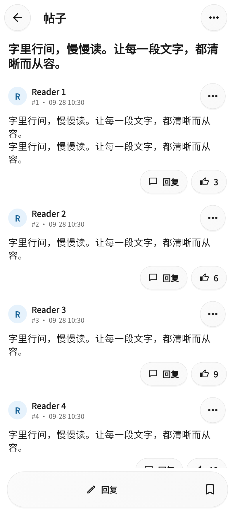
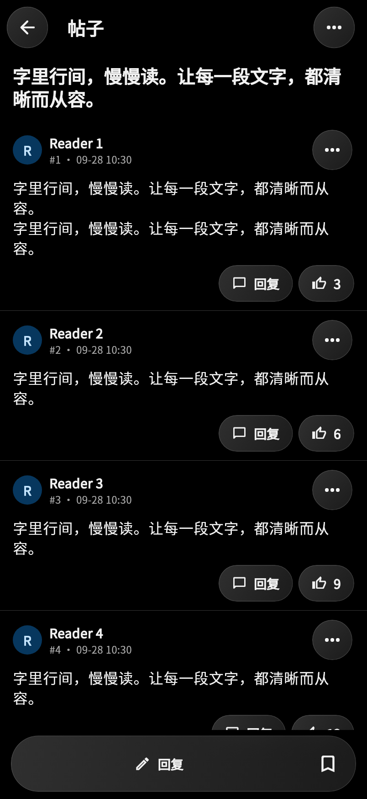

# 黑白配色、紧凑阅读与玻璃控件

2026-09-28。依据用户提供的两张 ChatGPT iOS 客户端浅色／深色截图调整本 App；不使用截图里的聊天内容作为产品需求。

## 配色与系统外观

- 默认白色底／纯黑底，主文字接近黑色／白色，辅助信息为中性灰；蓝色用于选中状态、链接和重点操作。取消原先由青色 seed 派生的大面积染色背景。
- `themeMode=system` 使用 Flutter 的系统亮度监听，不按时间判断。用户在 iOS 切换外观时，当前页面同步变化。
- 新版第一次启动通过 `monochromeAppearanceV1` 一次性迁移 `themeMode=system`、`darkPalette=amoled_dark`、`customPrimaryColor=0xFF007AFF`。后续在设置里主动选定的外观不会被每次启动覆盖；字号、背景图片和账号数据保留。
- 原有浅色／深色手动选择、深色灰／蓝／纯黑色板、accent、背景图、圆角设置继续可用。

## 字体

- 默认 `fontFamily=system`，iPhone 使用 iOS 系统字体及系统中文字形回退，不下载或打包思源宋体。
- 设置 → 外观 → 字体可选择系统字体或此前已有的 Noto Sans；选择立即应用到正文、标题、按钮和导航文字并保存。
- 系统字号和 App 字号缩放继续叠加。此处的自定义是选择内置字体与字号，没有新增任意字体文件导入器。

## 楼层密度

- `PostCard` 原来的外边距 16 + 内边距 18 改为每边 14 logical pixels，使用细分隔线代替每楼一张大圆角卡片。
- 正文行高从 1.65 改为 1.4，默认正文 16；头像从 radius 18 改为 16，头像／正文间距从 14 改为 6，回复摘要间距从 14 改为 8。
- 楼层操作仍可点击；大字号下通过 `Wrap` 换行，避免把按钮挤出屏幕。正文不固定高度、不截断。
- 主帖与楼中楼共用这套排版；之前的置顶帖单行列表和最近访问 FIFO 保留。

## 玻璃视觉的实现范围

- `GlassSurface` 使用局部裁剪的 `BackdropFilter`、半透明中性渐变、细描边、轻阴影及按下态；所有主要按钮类型、顶部操作、悬浮操作按钮共用样式。
- 底部导航、帖子回复栏、楼中楼回复栏使用悬浮胶囊。控件高度与 iPhone 底部安全区域仍由布局预留，列表末尾可以完整滚到可见区域。
- 同一块玻璃栏中的按钮共享外层材质，避免重复模糊与多层描边。菜单、输入框、弹窗使用统一圆角、中性色和边框；底部弹层有局部玻璃背景，确认弹窗使用背景模糊。
- 阅读正文不叠加模糊，不为每张长内容卡片创建全屏滤镜。iOS WebView 内容区不加玻璃覆盖层。
- `GlassAccessibility` 通过 iOS method channel 监听 `reduceTransparency` / `reduceMotion`，并在恢复前台时重新读取；高对比度也启用不透明背景。辅助功能开启时，玻璃滤镜／自定义材质动画相应关闭。
- 这是 Flutter 实现的玻璃风格，并非原生 `UIGlassEffect`，没有宣称包含 Apple 私有折射／流体形变或完全一致的原生效果。真实 iPhone 的流畅度和视觉仍需安装后确认。

## 验证与预览

- 本地 Dart analyze、全部 72 项 Flutter tests 通过；新增 6 项覆盖迁移只执行一次、字体切换与持久化、系统外观实时变化、不透明回退、iOS 辅助功能通知及 320 宽／2 倍字号的楼层操作。
- 下图来自真实 Flutter widgets 的离线 fixture，尺寸 402 × 874 logical pixels，Windows 无法渲染 Apple 系统字体，预览仅使用已有 Noto Sans 近似展示字形并载入正式图标；不是 iPhone 截屏，不包含系统状态栏，也不代表已验证真实账号接口。
- iOS 云构建与安装包信息单独记录在 [VALIDATION.md](VALIDATION.md)。

| 浅色 | 深色 |
| --- | --- |
|  |  |

## 参考与取舍

- [Apple Materials](https://developer.apple.com/design/human-interface-guidelines/materials)：玻璃主要用于控件与导航层，内容保持清晰；考虑降低透明度和高对比度。
- [Flutter BackdropFilter](https://api.flutter.dev/flutter/widgets/BackdropFilter-class.html)：裁剪模糊区域，避免为长阅读面板创建过多滤镜；有重叠的不同玻璃层不强行共用同一个 backdrop key。
- [Flutter ButtonStyle.backgroundBuilder](https://api.flutter.dev/flutter/material/ButtonStyle/backgroundBuilder.html)：统一按钮材质，保留 Material 的原有点击、禁用、语义与焦点行为。
